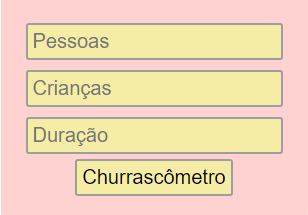
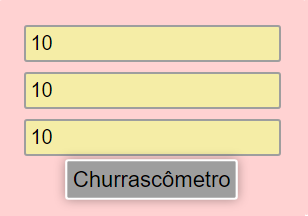
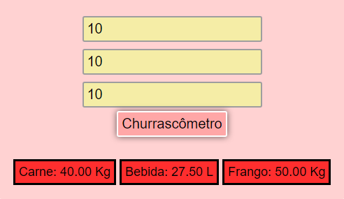

# Churrascômetro

Projeto proposto para usarmos HTML, CSS e JS para calcularmos o quanto de carne, bebida e frango precisamos para fazer um churrasco.

### Tela inicial

### Efeito ao clicarmos no input

### Efeito ao passarmos o mouse no botão

### Resultado

*A regra de negócio foi algo simples que inventei apenas para simular o cálculo.*
